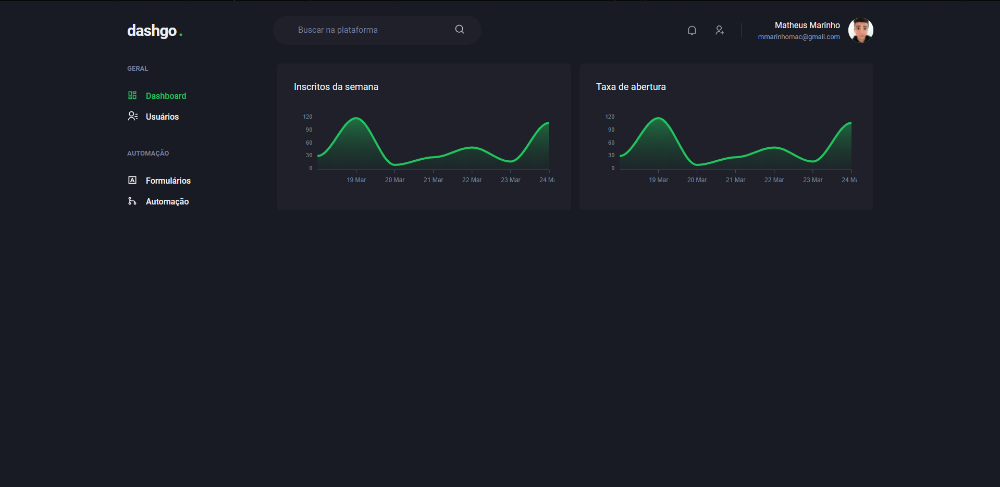

# Dashgo. dashboard app

 

### goodbye styled-components and sass !?
 

## About Dashgo.

is a dashboard with business intelligence with graphs presented with [**Apexcharts.js**](https://apexcharts.com/) and user control, to demonstrate declarative interface and responsiveness features of [**Chakra UI**](https://chakra-ui.com/).
 

## Technologies

Technologies and tools used in the development of the project:

- [Next.js](https://nextjs.org/)
- [TypeScript](https://www.typescriptlang.org/)
- [Chakra UI](https://chakra-ui.com/)
- [Apexcharts.js](https://apexcharts.com/)
- [React Hook Form](https://react-hook-form.com/)
- [Yup](https://github.com/jquense/yup)
- [React Query](https://react-query.tanstack.com/)
- [Mirage JS](https://miragejs.com/)
- [Faker](https://github.com/marak/Faker.js/)
 

## Licença

 

---
Made with 💖 by [**mmarinhomac**](https://github.com/mmarinhomac)